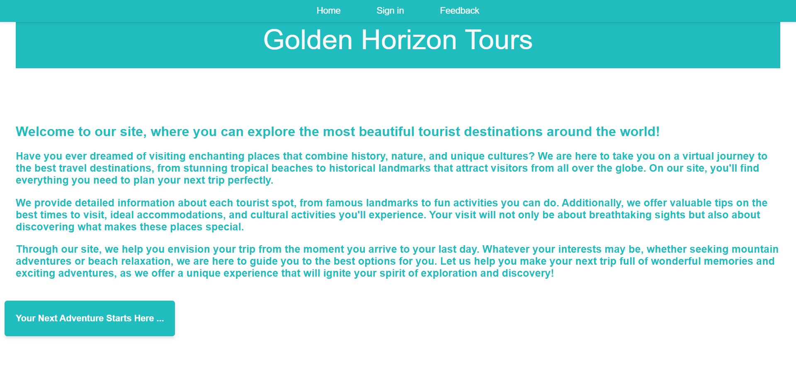
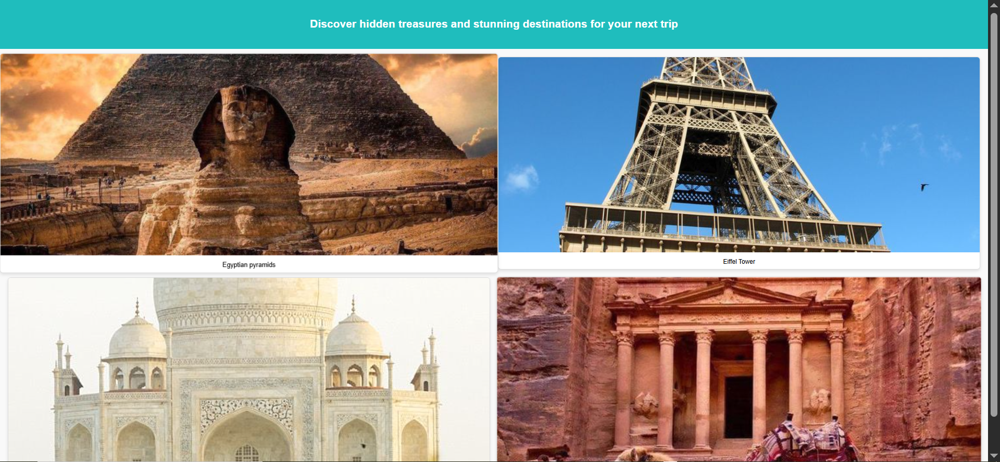
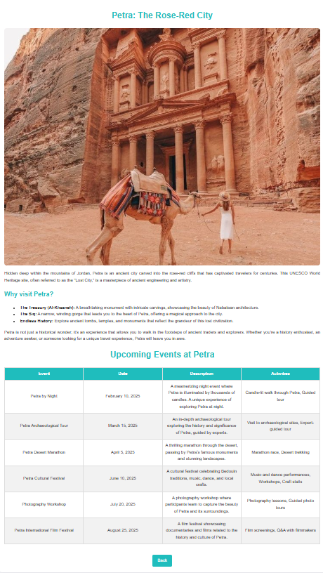

# Tourism Website

A responsive tourism website developed using HTML, CSS, and JavaScript.

The website was designed to showcase international travel destinations through an attractive and user-friendly interface. Users can explore different locations, browse destination information, and enjoy a smooth navigation experience.

## Technologies Used

* HTML
* CSS
* JavaScript

## Features

* Responsive website design
* Interactive user interface
* Multiple destination pages
* Easy navigation between locations
* Destination information and highlights
* Modern and clean layout

## Project Objectives

* Practice front-end web development
* Improve website design and navigation skills
* Create an engaging user experience
* Apply HTML, CSS, and JavaScript concepts in a real project

## Screenshots

### Home Page

The main landing page of the website featuring destination highlights and navigation options.

### Destination Selection

Users can browse and choose their preferred destination.

### Destination Information

Detailed information about the selected destination including attractions and key highlights.

## Author

Nour Sharabati
